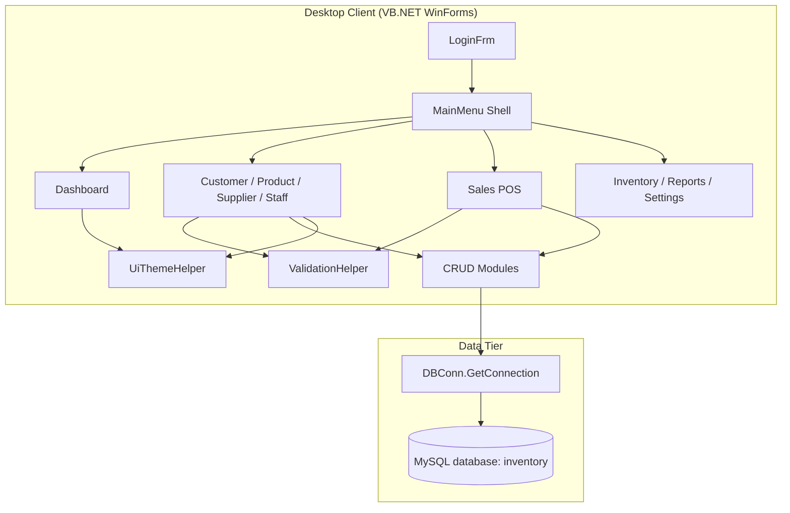
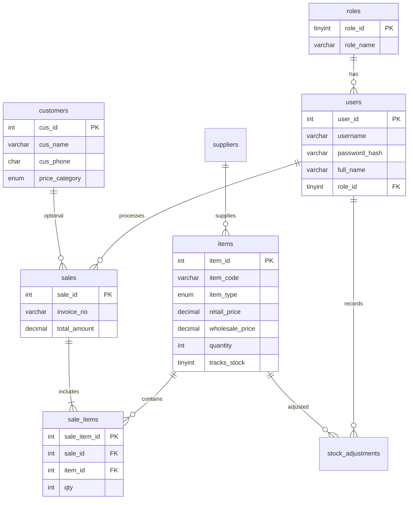
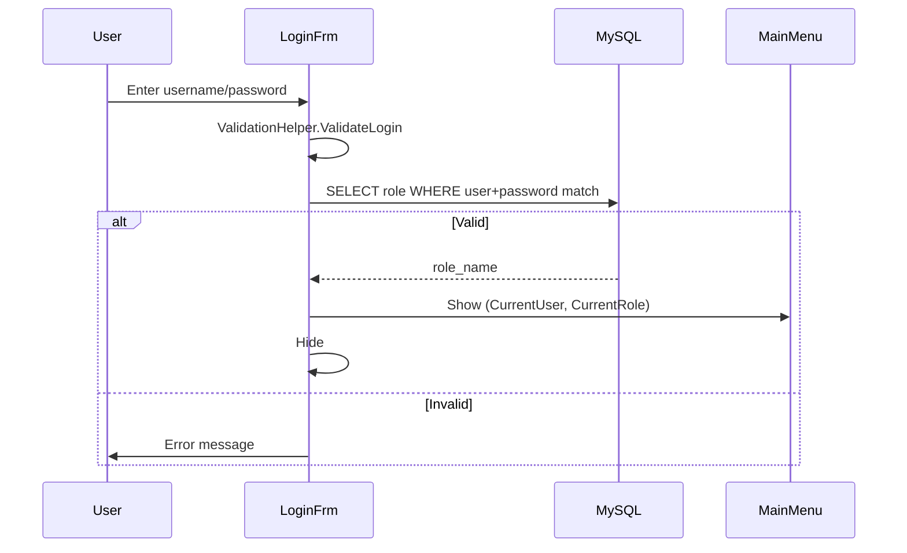

# S & N Tyre Center — Inventory & Service Management System  
## Complete Technical Documentation (VIVA & Project Report Guide)

**Course:** ICT 222 (3)  
**Student:** H M S Thathsiluni — 22SSL6961  
**Institution:** Sabaragamuwa University of Sri Lanka  
**Client organization:** S & N Tyre Center, Piliyandala  
**Document purpose:** Explain every architectural decision, module, function, and business rule so you can defend this project confidently in your VIVA.

---

## Table of Contents

1. [Executive Summary](#1-executive-summary)  
2. [Problem & Solution](#2-problem--solution)  
3. [Project Approach & Methodology](#3-project-approach--methodology)  
4. [Technology Stack](#4-technology-stack)  
5. [System Architecture](#5-system-architecture)  
6. [Folder & File Structure](#6-folder--file-structure)  
7. [Database Design](#7-database-design)  
8. [Application Layers](#8-application-layers)  
9. [Module-by-Module Breakdown](#9-module-by-module-breakdown)  
10. [Complete Function Reference](#10-complete-function-reference)  
11. [Business Logic & Workflows](#11-business-logic--workflows)  
12. [Validation Rules](#12-validation-rules)  
13. [Security & Access Control](#13-security--access-control)  
14. [UI/UX Design](#14-uiux-design)  
15. [Setup & Deployment](#15-setup--deployment)  
16. [Testing Checklist](#16-testing-checklist)  
17. [Known Limitations & Future Work](#17-known-limitations--future-work)  
18. [VIVA Preparation — Likely Questions & Answers](#18-viva-preparation--likely-questions--answers)  
19. [Demonstration Script (5–10 minutes)](#19-demonstration-script-510-minutes)  
20. [Glossary](#20-glossary)

---

## 1. Executive Summary

This project replaces the **manual notebook-based operations** at S & N Tyre Center with a **desktop application** that centralizes:

- Tyre/tube/service **inventory**
- **Customer** records with price categories (Retail / Wholesale / Distributor)
- **Supplier** management
- **Staff** accounts with roles
- **Point of Sale (POS)** billing
- **Stock** monitoring and adjustments
- **Reports** for management decisions

The system is built as a **single-user desktop app** (expandable later) using **VB.NET WinForms**, **Guna.UI2** for modern UI, and **MySQL** (via XAMPP) for persistent storage.

**Design philosophy:** Keep the architecture simple enough for a second-year project, but professional enough for a real small business: separate **UI (Forms)**, **data access (CRUD modules)**, **shared validation**, and **database integrity (constraints + triggers)**.

---

## 2. Problem & Solution

### 2.1 Problems at the tyre center (manual system)

| Problem | Impact |
|---------|--------|
| Handwritten stock records | Slow search (10–20 min per tyre size) |
| No real-time stock after sales | 8–12 stock mismatches/month |
| Manual invoice calculation | 5–10 pricing errors/week |
| Paper records | Risk of loss/damage |
| Phone/social media stock checks | Staff overload, customer delays |

### 2.2 How this system solves them

| Manual pain | System feature |
|-------------|----------------|
| Slow tyre search | Product module + POS search by code, brand, size |
| Stock mismatch | `items.quantity`, triggers on sale, low-stock dashboard |
| Billing errors | POS auto-calculates line totals; customer price category |
| Lost records | MySQL database with backups possible |
| No overview | Dashboard KPIs + Reports module |

### 2.3 Why VB.NET + MySQL (feasibility)

- **VB.NET:** Event-driven WinForms match how shop staff think (click buttons, fill forms).
- **MySQL/XAMPP:** Free, familiar in university labs, supports constraints/triggers/views.
- **No cloud required:** Works on existing shop PC (i3, 4GB RAM per proposal).

---

## 3. Project Approach & Methodology

### 3.1 Development approach (layered, not over-engineered)

```
┌─────────────────────────────────────────┐
│  Presentation Layer (WinForms + Guna) │
│  LoginFrm, MainMenu, AddCustomer, ...   │
├─────────────────────────────────────────┤
│  Business / Validation Layer            │
│  ValidationHelper, form event handlers  │
├─────────────────────────────────────────┤
│  Data Access Layer (CRUD Modules)       │
│  CustomerCRUD, ItemCRUD, StaffCRUD, ... │
├─────────────────────────────────────────┤
│  Database Layer (MySQL)                 │
│  Tables, FKs, CHECK, Triggers, Views    │
└─────────────────────────────────────────┘
```

**Why not one giant form with SQL inside?**  
Separating `CustomerCRUD.vb` from `AddCustomer.vb` means:
- Easier to test and explain in VIVA
- Same queries reusable (e.g. POS loads customers via `CustomerCRUD.LoadCustomers()`)
- UI changes do not break database logic

### 3.2 Unified product model (important design choice)

**Tyres, tubes, services, and accessories** share one table: `items`, distinguished by `item_type`.

**Why?** The proposal requires services (alignment, balancing, rim setting) to be sold through the **same POS** as tyres. One table avoids duplicate billing code.

| `item_type` | Tracks stock? | Example |
|-------------|---------------|---------|
| Tyre | Yes | 195/65R15 Ceat |
| Tube | Yes | 165/13 tube |
| Service | No (`tracks_stock=0`, qty=0) | Wheel alignment |
| Accessory | Yes | Tubeless valve |

### 3.3 Project timeline (from proposal)

| Phase | Weeks | Deliverable |
|-------|-------|-------------|
| Requirements | 1–2 | Proposal, problem statement |
| Design | 3–4 | ERD, UI mockups (`docs/UI_MOCKUPS.md`) |
| Development | 5–7 | Forms + CRUD + database |
| Testing | 8 | User scenarios, bug fixes |
| Documentation | 9–10 | Report, VIVA, presentation |

---

## 4. Technology Stack

| Component | Technology | Version / Notes |
|-----------|------------|-----------------|
| Language | Visual Basic .NET | .NET Framework 4.8 |
| IDE | Visual Studio | 2022+ |
| UI framework | Windows Forms | + Guna.UI2.WinForms 2.0.4.7 |
| Database | MySQL / MariaDB | XAMPP 10.4+ |
| DB connector | MySql.Data | 9.7.0 |
| OS | Windows 10/11 | Desktop only |
| Config | `App.config` | Binding redirects for dependencies |

**Startup form:** `LoginFrm` (set in `My Project/Application.myapp` → `MainForm=LoginFrm`).

---

## 5. System Architecture

### 5.1 High-level architecture diagram



### 5.2 MainMenu shell pattern (MDI-like, single window)

`MainMenu` does **not** open separate windows for each module. It uses **embedded child forms**:

1. Sidebar button clicked  
2. `OpenModule(frm, title, activeBtn)` runs  
3. `pnlContent.Controls.Clear()`  
4. Child form: `TopLevel=False`, `FormBorderStyle=None`, `Dock=Fill`  
5. Title bar updates (`lblFormTitle`, `lblWelcome`)

**Benefits:** Professional single-window app; easy role-based menu hiding.

### 5.3 Data flow (example: Add Customer)

```
User fills form → btnAdd click
    → ValidationHelper.ValidateCustomer(...)
    → CustomerCRUD.AddCustomer(...)
        → GetConnection()
        → Parameterized INSERT
    → MessageBox success
    → dgvCustomers.DataSource = CustomerCRUD.LoadCustomers()
```

**Parameterized queries (`@cus_name`, etc.)** prevent basic SQL injection — mention this in VIVA.

---

## 6. Folder & File Structure

```
tyre_mgt/
├── tyre_mgt.slnx              # Solution file
├── tyre_mgt.vbproj            # Project compile list
├── App.config                 # .NET binding redirects
├── packages.config            # NuGet packages
│
├── database/
│   ├── 01_schema.sql          # Full DB: tables, views, triggers
│   └── 02_seed.sql            # Demo users, products, customers
│
├── docs/
│   └── UI_MOCKUPS.md          # Screen layouts for report
│
├── README.md                  # Quick start
├── DETAIL.md                  # This file (VIVA guide)
│
├── DBConn.vb                  # Connection string + GetConnection()
├── ValidationHelper.vb        # All input validation rules
├── UiThemeHelper.vb           # Colors, buttons, grids
│
├── CustomerCRUD.vb            # customers table
├── ItemCRUD.vb                # items table
├── SupplierCRUD.vb            # suppliers table
├── StaffCRUD.vb               # users + roles
│
├── LoginFrm.vb                # + LoginFrm.Designer.vb, .resx
├── MainMenu.vb
├── Dashboard.vb
├── AddCustomer.vb             # Customer form (CustomerForm in proposal)
├── ProductMgtFrm.vb
├── AddSupplierMgt.vb
├── StaffMgtFrm.vb
├── SalesPOS.vb
├── InventoryMgtFrm.vb
├── ReportsFrm.vb
├── Settings.vb
│
├── My Project/                # App entry, resources, settings
├── packages/                  # NuGet DLLs (MySql.Data, Guna.UI2, ...)
└── bin/Debug/                 # Compiled tyre_mgt.exe
```

### 6.1 File naming convention

| Pattern | Meaning | Example |
|---------|---------|---------|
| `*Frm.vb` | Main form code | `ProductMgtFrm.vb` |
| `*.Designer.vb` | Auto-generated UI layout | `ProductMgtFrm.Designer.vb` |
| `*.resx` | Form resources (images, strings) | `MainMenu.resx` |
| `*CRUD.vb` | Database operations module | `ItemCRUD.vb` |

### 6.2 Legacy / unused files (do not demo)

| File | Status |
|------|--------|
| `Form1.vb`, `Main_Menu.vb` | Early prototypes — not in main navigation |
| `AddCustomerControl.vb` | User control experiment — not used by MainMenu |

---

## 7. Database Design

### 7.1 Entity Relationship (conceptual)



### 7.2 Tables summary

| Table | Purpose | Key columns |
|-------|---------|-------------|
| `roles` | Admin, Manager, Cashier | `role_id`, `role_name` |
| `users` | Staff login accounts | `username`, `password_hash`, `role_id` |
| `customers` | Buyers + price tier | `price_category` ENUM |
| `suppliers` | Tyre distributors | `sup_name`, `sup_company` |
| `items` | Products + services | `item_type`, `retail_price`, `quantity` |
| `sales` | Invoice header | `invoice_no`, `total_amount` |
| `sale_items` | Invoice lines | `qty`, `unit_price`, `line_total` |
| `stock_adjustments` | Stock in/out audit | `adj_qty`, `reason` |
| `shop_settings` | Shop profile (1 row) | `shop_name`, `invoice_prefix` |

### 7.3 Views (reporting helpers)

| View | Purpose |
|------|---------|
| `v_low_stock_items` | Items where `quantity <= reorder_level` |
| `v_daily_sales_summary` | Revenue grouped by date |

### 7.4 Triggers (database-enforced business rules)

| Trigger | When | What it does |
|---------|------|--------------|
| `trg_sale_items_before_insert` | Before sale line | Blocks sale if `qty > available stock` |
| `trg_sale_items_after_insert` | After sale line | Reduces `items.quantity` |
| `trg_stock_adjustment_after_insert` | After adjustment | Updates quantity; blocks negative stock |

**VIVA tip:** Say *"Critical stock rules are enforced in the database, not only in the UI, so data stays correct even if we add another client later."*

### 7.5 CHECK constraints (examples)

- Phone: 10 digits (`REGEXP '^[0-9]{10}$'`)
- `price_category`: Retail | Wholesale | Distributor
- `wholesale_price <= retail_price` (or wholesale = 0)
- Services: `tracks_stock=0` and `quantity=0`

### 7.6 Seed data login accounts

| Username | Password | Role |
|----------|----------|------|
| `admin` | `admin123` | Admin |
| `manager` | `manager789` | Manager |
| `cashier` | `cash456` | Cashier |

---

## 8. Application Layers

### 8.1 DBConn.vb — Database connectivity

| Member | Type | Description |
|--------|------|-------------|
| `connString` | Private ReadOnly String | `Server=localhost;Database=inventory;User Id=root;Password=;` |
| `GetConnection()` | Function → `MySqlConnection` | Creates connection, opens it, shows error MessageBox on failure |
| `TestConnection()` | Function → Boolean | Returns True if connection opens |

**Note for VIVA:** In production you would move the connection string to `App.config` and encrypt passwords. For coursework, localhost/root with empty password is standard for XAMPP.

### 8.2 CRUD modules — Data access pattern

Each entity has a **Module** (not Class) with Shared/Public methods:

| Module | Table(s) | Operations |
|--------|----------|------------|
| `CustomerCRUD` | `customers` | Add, Load, Update, Delete, Search |
| `ItemCRUD` | `items` | Load, Search, Add, Update, Delete (soft) |
| `SupplierCRUD` | `suppliers` | Load, Search, Add, Update, Delete (soft) |
| `StaffCRUD` | `users`, `roles` | Load, Add, Update |

**Soft delete:** Products and suppliers set `is_active=0` instead of physical DELETE — preserves history.

**Schema compatibility:** `CustomerCRUD` tries `price_category` first, falls back to legacy `cus_pricetyre` column if old database exists.

### 8.3 ValidationHelper.vb — Presentation-layer validation

Centralizes rules before any INSERT/UPDATE. Returns `ValidationOutcome` struct (`IsValid`, `Message`, `Kind`).

See [Section 12](#12-validation-rules) for full rule list.

### 8.4 UiThemeHelper.vb — Consistent branding

| Member | Purpose |
|--------|---------|
| `PrimaryOrange` | Brand color RGB(255,128,0) |
| `LightPeach` | GroupBox background |
| `StylePrimaryButton` | Orange rounded buttons |
| `StyleDangerButton` | Red delete buttons |
| `ApplyGridTheme` | Grid header styling |

---

## 9. Module-by-Module Breakdown

### 9.1 LoginFrm — Authentication gateway

**Files:** `LoginFrm.vb`, `LoginFrm.Designer.vb`

**UI elements:**
- Left brand panel (dark) — shop name
- Right card — username, password, Sign In
- Footer — demo account hints

**Logic flow:**

```
btnLogin_Click
  → ValidateLogin (min 4 char password)
  → TryLogin(..., "password_hash")  // new schema
  → if fail, TryLogin(..., "password")  // old schema
  → if role found: OpenMain → MainMenu.Show, LoginFrm.Hide
  → else: "Invalid username or password"
```

**Key methods:**

| Method | Visibility | Role |
|--------|------------|------|
| `LoginFrm_Load` | Private | Styles button, focus username |
| `btnLogin_Click` | Private | Main login handler |
| `TryLogin` | Private Function | SQL auth, returns `role_name` or Nothing |
| `OpenMain` | Private Sub | Sets `CurrentUser`, `CurrentRole` on MainMenu |

---

### 9.2 MainMenu — Application shell & authorization

**Files:** `MainMenu.vb`, `MainMenu.Designer.vb`

**Properties:**
- `CurrentUser As String` — logged-in username
- `CurrentRole As String` — Admin | Manager | Cashier

**`OpenModule(frm, title, activeBtn)`** — Core navigation method.

**Role-based menu visibility (`MainMenu_Load`):**

| Menu item | Admin | Manager | Cashier |
|-----------|:-----:|:-------:|:-------:|
| Dashboard | ✓ | ✓ | ✓ |
| Customer | ✓ | ✓ | ✓ |
| Sales POS | ✓ | ✓ | ✓ |
| Product | ✓ | ✓ | — |
| Supplier | ✓ | ✓ | — |
| Inventory | ✓ | ✓ | — |
| Staff | ✓ | — | — |
| Reports | ✓ | ✓ | — |
| Settings | ✓ | — | — |
| Logout | ✓ | ✓ | ✓ |

**`HighlightButton`** — Resets sidebar to orange; active button gray/white.

---

### 9.3 Dashboard — Management overview

**Purpose:** At-a-glance KPIs for admin/manager.

**Stat cards:**
1. Registered customers — `COUNT(*) FROM customers`
2. Active products — `COUNT(*) FROM items WHERE is_active=1`
3. Today's sales — `SUM(total_amount)` for current date
4. Low stock count — items where `quantity <= reorder_level`

**Low stock grid:** Top 50 items needing reorder.

**Quick actions:** Jump to POS, Products, Reports via `GetMainMenu()?.OpenModule(...)`.

**Key methods:** `LoadDashboardData`, `Scalar`, `ScalarDec`, `LoadLowStockGrid`, `btnRefreshDashboard_Click`.

---

### 9.4 AddCustomer — Customer management (CustomerForm)

**UI sections:**
- **Customer Details** — name, phone, email, address, price category, CRUD buttons
- **Customer History** — search bar + DataGridView

**Price categories (business rule):**
- **Retail** → POS uses `retail_price`
- **Wholesale / Distributor** → POS uses `wholesale_price` (if > 0)

**Events:**

| Event | Action |
|-------|--------|
| `btnAddCustomerCusfrm_Click` | Validate → `CustomerCRUD.AddCustomer` → refresh grid |
| `btnUpdateCustomerCusfrm_Click` | Requires `txtCustomerID` from grid selection |
| `btnDeleteCustomerCusfrm_Click` | Confirm → hard DELETE |
| `dgvCustomers_CellContentClick` | Load row into form fields |
| `txtsearchcustomer_TextChanged` | Live search via `SearchCustomers` |

---

### 9.5 ProductMgtFrm — Product & service catalog

**Fields:** item_code, item_name, item_type (combo), brand, tyre_size, retail/wholesale price, quantity, reorder level.

**Service rule:** When type = Service → quantity forced to 0, `tracks_stock=0` in database.

**CRUD:** Uses `ItemCRUD` module; `DeleteItem` is soft delete (`is_active=0`).

**Search:** `ItemCRUD.SearchItems` — LIKE on code, name, brand, size, type.

---

### 9.6 AddSupplierMgt — Supplier management

**Fields:** contact name, company, phone, email, address.

**Validation:** Name required; phone 10 digits; email format if provided.

**Delete:** Soft delete (`is_active=0`).

---

### 9.7 StaffMgtFrm — Staff / user accounts

Maps to `users` table (staff are system users).

**Fields:** username, full name, password, phone, role combo (Admin/Manager/Cashier), active checkbox.

**`StaffCRUD.AddStaff`** — Inserts with `role_id` from `GetRoleId(roleName)`.

**`StaffCRUD.UpdateStaff`** — Optional password change only if new password entered.

---

### 9.8 SalesPOS — Point of sale

**Layout:**
- **Left:** Product catalog + search
- **Right top:** Customer + payment method
- **Right middle:** Shopping cart (in-memory `DataTable`)
- **Right bottom:** Subtotal, discount, total, Complete Sale

**In-memory cart columns:** `item_id`, `item_name`, `qty`, `unit_price`, `line_total`

**Pricing logic (`dgvCatalog_CellClick`):**
```
if customer.category = "Retail"
    unit_price = retail_price
else
    unit_price = wholesale_price (fallback to retail if 0)
```

**`RecalcTotals`:** Sums line totals, subtracts discount (capped at subtotal).

**Current status:** `btnCompleteSale` shows demo message — full `sales`/`sale_items` INSERT with transaction is planned enhancement (triggers already exist in DB).

---

### 9.9 InventoryMgtFrm — Stock control

**Adjustment panel:** reason (Purchase/Damage/Return/Correction/Other), qty (+/-), remarks, Apply button.

**Stock grid:** All items; filter "low stock only" checkbox.

**Current status:** Apply adjustment shows info message — DB trigger `trg_stock_adjustment_after_insert` ready when INSERT is wired.

---

### 9.10 ReportsFrm — Business reports

| Report type | Data source |
|-------------|-------------|
| Daily Sales Summary | `sales` grouped by date (date range filter) |
| Low Stock Items | `items` where qty ≤ reorder |
| Product Inventory List | `ItemCRUD.LoadItems()` |
| Customer List | `CustomerCRUD.LoadCustomers()` |

**Export:** CSV via `SaveFileDialog` + `StreamWriter`.

---

### 9.11 Settings — Shop profile

Fields: shop name, address, phone, default reorder level.  
Save shows confirmation — `shop_settings` table persistence can be connected next.

---

## 10. Complete Function Reference

### 10.1 DBConn.vb

| Function | Returns | Description |
|----------|---------|-------------|
| `GetConnection()` | `MySqlConnection` | Open connection to `inventory` database |
| `TestConnection()` | `Boolean` | Connection health check |

---

### 10.2 CustomerCRUD.vb

| Method | Parameters | Description |
|--------|------------|-------------|
| `AddCustomer` | name, phone, email, address, priceCategory | INSERT customer |
| `LoadCustomers` | — | `SELECT *` → DataTable |
| `UpdateCustomer` | id, name, phone, email, address, priceCategory | UPDATE by `cus_id` |
| `DeleteCustomer` | cus_id | Hard DELETE |
| `SearchCustomers` | keyword | LIKE search across name, phone, email, address, price column |
| `FillCustomerSearch` | conn, dt, keyword, priceColumn | Private helper for search |

---

### 10.3 ItemCRUD.vb

| Method | Parameters | Description |
|--------|------------|-------------|
| `LoadItems` | — | Active items ordered by name |
| `SearchItems` | keyword | Multi-field LIKE search |
| `AddItem` | code, name, type, brand, size, retail, wholesale, qty, reorder | INSERT; sets `tracks_stock` by type |
| `UpdateItem` | id + same fields | UPDATE item |
| `DeleteItem` | id | Soft delete (`is_active=0`) |

---

### 10.4 SupplierCRUD.vb

| Method | Description |
|--------|-------------|
| `LoadSuppliers` | Active suppliers list |
| `SearchSuppliers` | Search name, company, phone |
| `AddSupplier` | INSERT |
| `UpdateSupplier` | UPDATE by `sup_id` |
| `DeleteSupplier` | Soft delete |

---

### 10.5 StaffCRUD.vb

| Method | Description |
|--------|-------------|
| `LoadStaff` | JOIN users + roles |
| `AddStaff` | INSERT user with role |
| `UpdateStaff` | UPDATE user; optional password |
| `GetRoleId` | Private — lookup role_id by name |

---

### 10.6 ValidationHelper.vb

| Function | Purpose |
|----------|---------|
| `OkOptional` | Valid empty result |
| `Fail` | Invalid with message |
| `RequireText` | Non-empty string, max length |
| `ValidatePhone` | Exactly 10 digits |
| `ValidateEmail` | Regex email; optional or required |
| `ValidatePrice` | Non-negative, optional > 0 |
| `ValidateQuantity` | Integer ≥ 0 |
| `ValidateDiscountPercent` | 0–100 |
| `ValidateLogin` | Username + password ≥ 4 chars |
| `ValidateCustomer` | Full customer form rules |
| `IsValidPriceCategory` | Retail/Wholesale/Distributor |
| `ValidateItemCode` | Alphanumeric + hyphen, 3–30 chars |
| `ValidateItem` | Full product form rules |
| `ValidateSaleLine` | Qty, price, stock check |
| `ShowIfInvalid` | MessageBox if invalid; returns False |

---

### 10.7 UiThemeHelper.vb

| Method | Purpose |
|--------|---------|
| `StylePrimaryButton` | Orange Guna button |
| `StyleSecondaryButton` | Peach button |
| `StyleDangerButton` | Red delete button |
| `StyleGroupBox` | Peach group box |
| `ApplyGridTheme` | Grid header/row styling |
| `StyleTitleLabel` | Orange 16pt title |

---

### 10.8 LoginFrm.vb

| Method | Purpose |
|--------|---------|
| `TryLogin` | Authenticate; returns role name |
| `OpenMain` | Launch MainMenu with session |

---

### 10.9 MainMenu.vb

| Method | Purpose |
|--------|---------|
| `OpenModule` | Embed child form in `pnlContent` |
| `HighlightButton` | Sidebar active state |
| `btn*_Click` | Navigate to each module |
| `btnLogoutMmenu_Click` | Confirm → new LoginFrm |

---

### 10.10 Dashboard.vb

| Method | Purpose |
|--------|---------|
| `LoadDashboardData` | Refresh all KPIs |
| `Scalar` / `ScalarDec` | Run aggregate SQL |
| `LoadLowStockGrid` | Fill low stock DGV |
| `GetMainMenu` | Walk parent chain to find shell |

---

### 10.11 SalesPOS.vb

| Method | Purpose |
|--------|---------|
| `InitCart` | Create cart DataTable |
| `LoadCatalog` | ItemCRUD.LoadItems |
| `LoadCustomers` | Combo with Walk-in + DB customers |
| `GetCustomerCategory` | Price tier for selected customer |
| `RecalcTotals` | Subtotal/discount/total |
| `ComboItem` | Inner class for customer combo display |

---

### 10.12 ReportsFrm.vb

| Method | Purpose |
|--------|---------|
| `QueryTable` | Parameterized report query |
| `btnExportReport_Click` | Export DGV to CSV |

---

## 11. Business Logic & Workflows

### 11.1 Login workflow



### 11.2 Customer → POS price workflow

1. Customer registered with `price_category = Wholesale`
2. Cashier selects customer in POS combo
3. On product click, `GetCustomerCategory()` returns `Wholesale`
4. `unit_price = items.wholesale_price`

### 11.3 Intended sale workflow (when POS save completed)

1. Validate cart not empty  
2. `BEGIN TRANSACTION`  
3. INSERT `sales` (invoice_no, totals, user_id, cus_id)  
4. For each cart row: INSERT `sale_items`  
5. Triggers auto-reduce stock  
6. `COMMIT`  
7. Print/show invoice  

### 11.4 Low stock alert workflow

1. `items.quantity` updated by sale or adjustment  
2. Dashboard query: `quantity <= reorder_level AND tracks_stock=1`  
3. Manager sees count on red stat card + detail grid  
4. Reports → "Low Stock Items" for printable list  

---

## 12. Validation Rules

### 12.1 Two-layer validation (best practice)

| Layer | Where | Example |
|-------|-------|---------|
| **UI / App** | `ValidationHelper.vb` | Phone must be 10 digits before save |
| **Database** | CHECK constraints | Same phone rule in SQL |

### 12.2 Rule table (memorize for VIVA)

| Field | Rule |
|-------|------|
| Username | Required, max 50 |
| Password | Required, min 4 characters |
| Phone | Exactly 10 numeric digits (Sri Lankan mobile) |
| Email | Optional; if present must match `x@y.z` pattern |
| Customer name | Required, max 100 |
| Address | Required, max 400 |
| Price category | Must be Retail, Wholesale, or Distributor |
| Item code | 3–30 chars, letters/numbers/hyphen |
| Retail price | Required, > 0 for products |
| Wholesale | ≤ retail (if non-zero) |
| Service quantity | Must be 0 |
| Sale qty | ≥ 1, ≤ available stock if tracked |
| Discount | Cannot exceed subtotal (POS) |

---

## 13. Security & Access Control

### 13.1 What is implemented

- Login required before MainMenu  
- Role-based menu hiding (UI level)  
- Parameterized SQL queries  
- Inactive users can be flagged (`is_active=0`) — staff update  

### 13.2 What to say about limitations (honesty scores points)

| Topic | Current state | Improvement |
|-------|---------------|-------------|
| Password storage | Plain text in `password_hash` for demo | bcrypt/SHA256 hashing |
| Authorization | Menu hidden, not enforced on every button | Central permission check |
| Connection string | Hardcoded in `DBConn.vb` | `App.config` + encryption |
| Audit trail | Partial (`created_at` on some tables) | Full login/log tables |
| Session | Properties on MainMenu only | Secure session token |

**Strong VIVA answer:** *"Role-based access is implemented at the presentation layer suitable for a single-shop desktop deployment. For multi-branch or web deployment, we would add server-side authorization."*

---

## 14. UI/UX Design

### 14.1 Design principles

1. **Consistency** — Same peach group boxes, orange buttons on every module  
2. **Familiar layout** — Details on top, searchable list below (CRUD pattern)  
3. **Docking** — Child forms fill MainMenu content panel  
4. **Feedback** — MessageBox on success/error/validation  

### 14.2 Color palette

| Color | RGB | Usage |
|-------|-----|-------|
| Primary Orange | 255, 128, 0 | Buttons, titles |
| Light Peach | 255, 224, 192 | GroupBoxes |
| Dark Gray | 30, 30, 30 | Sidebar, checkout panel |
| Danger Red | 220, 53, 69 | Delete buttons |

See `docs/UI_MOCKUPS.md` for ASCII screen layouts.

---

## 15. Setup & Deployment

### 15.1 Developer machine setup

1. Install Visual Studio 2022+ with **.NET desktop development**  
2. Install **XAMPP** → start **Apache** (optional) and **MySQL**  
3. Clone/open `tyre_mgt.slnx`  
4. Restore NuGet packages (right-click solution)  
5. phpMyAdmin → Import `database/01_schema.sql` then `02_seed.sql`  
6. Verify `DBConn.vb` connection string matches your MySQL user  
7. F5 → login `admin` / `admin123`  

### 15.2 Shop deployment checklist

- [ ] Install XAMPP/MySQL on shop PC  
- [ ] Import schema + seed (or production data)  
- [ ] Copy `bin\Release\` folder or create installer  
- [ ] Test printer for invoices (future)  
- [ ] Daily MySQL backup (`mysqldump inventory`)  

---

## 16. Testing Checklist

| # | Test case | Expected result |
|---|-----------|-----------------|
| 1 | Login admin | Full menu visible |
| 2 | Login cashier | Only Dashboard, Customer, POS |
| 3 | Add customer invalid phone | Validation error |
| 4 | Add customer valid | Appears in grid |
| 5 | Search customer | Filtered rows |
| 6 | Add tyre product | In product grid |
| 7 | Add service qty=0 | Saves successfully |
| 8 | POS retail customer | Retail price on item |
| 9 | POS wholesale customer | Wholesale price |
| 10 | POS oversell stock | Validation blocks |
| 11 | Dashboard refresh | KPIs update |
| 12 | Low stock report | Lists items below reorder |
| 13 | Export CSV | File created |
| 14 | Logout | Returns to login |

---

## 17. Known Limitations & Future Work

| # | Limitation | Planned enhancement |
|---|------------|---------------------|
| 1 | POS does not yet INSERT into `sales` | Complete sale + invoice print |
| 2 | Inventory adjustment UI only | Wire to `stock_adjustments` |
| 3 | Settings not saved to DB | Connect `shop_settings` |
| 4 | Plain-text passwords | Hashing algorithm |
| 5 | Single PC / no network multi-user | LAN shared database |
| 6 | No barcode scanner integration | USB scanner → item_code lookup |
| 7 | Hard delete customers | Soft delete like products |

---

## 18. VIVA Preparation — Likely Questions & Answers

### Q1: Why did you choose VB.NET?
**A:** VB.NET WinForms is event-driven and beginner-friendly. The tyre shop needs a simple desktop app, not a complex web system. It integrates well with MySQL and Guna UI for professional forms without web hosting costs.

### Q2: Explain your database design.
**A:** Normalized relational schema: users/roles for security, customers, suppliers, unified `items` table for tyres and services, `sales` + `sale_items` for invoices, `stock_adjustments` for audit. Foreign keys maintain referential integrity; triggers enforce stock rules at database level.

### Q3: What is the unified items table?
**A:** Products and services share one table with `item_type` ENUM. Services have `tracks_stock=0` so POS does not reduce quantity. This matches the proposal requirement to bill services and tyres through one interface.

### Q4: How do you prevent SQL injection?
**A:** All dynamic values use parameterized queries — e.g. `cmd.Parameters.AddWithValue("@user", username)` — never string concatenation of user input into SQL.

### Q5: How does role-based access work?
**A:** After login, `role_name` is stored in `MainMenu.CurrentRole`. On load, sidebar buttons are shown/hidden per role. Admin has full access; Cashier only Dashboard, Customers, and POS.

### Q6: Difference between retail and wholesale customer?
**A:** `customers.price_category` determines which price column POS uses: `retail_price` or `wholesale_price` from `items` table.

### Q7: What happens when stock is low?
**A:** Dashboard counts items where `quantity <= reorder_level`. `v_low_stock_items` view and Reports module list them for reordering from suppliers.

### Q8: What are database triggers used for?
**A:** (1) Block overselling before insert to `sale_items`. (2) Auto-decrement stock after sale. (3) Apply stock adjustments and prevent negative quantity.

### Q9: What validation do you perform?
**A:** Client-side in `ValidationHelper` for immediate user feedback; server-side CHECK constraints and triggers in MySQL for data integrity.

### Q10: What would you improve given more time?
**A:** Complete POS transaction saving, password hashing, invoice printing, barcode support, and LAN multi-user access.

### Q11: Economic feasibility?
**A:** Zero license cost — VB.NET Community, XAMPP, MySQL are free. Runs on existing hardware.

### Q12: How is this different from ERP?
**A:** ERP is expensive and complex for a small tyre shop. This system provides focused modules: inventory, POS, customers — without unnecessary enterprise features.

---

## 19. Demonstration Script (5–10 minutes)

**Recommended order for examiners:**

1. **30 sec** — Introduce problem (manual notebooks) and solution (this system)  
2. **1 min** — Show `database/01_schema.sql` ERD concept in phpMyAdmin (tables + relationships)  
3. **1 min** — Login as **admin** → explain role-based sidebar  
4. **1 min** — Dashboard: point to 4 KPI cards + low stock grid  
5. **1 min** — Customer: add/search, explain price category  
6. **1 min** — Product: show tyre + service entries  
7. **2 min** — POS: select wholesale customer, add tyre to cart, show totals, mention stock validation  
8. **1 min** — Reports: generate low stock, export CSV  
9. **30 sec** — Logout; mention future: full invoice save, password hashing  

---

## 20. Glossary

| Term | Meaning |
|------|---------|
| **POS** | Point of Sale — billing screen |
| **CRUD** | Create, Read, Update, Delete |
| **Soft delete** | Mark `is_active=0` instead of deleting row |
| **Reorder level** | Minimum quantity before low-stock alert |
| **Price category** | Retail / Wholesale / Distributor |
| **tracks_stock** | Whether item quantity decreases on sale |
| **Parameterized query** | SQL with `@placeholders` for safe input |
| **Trigger** | SQL code that runs automatically on INSERT/UPDATE |
| **Seed data** | Sample rows for testing (`02_seed.sql`) |

---

## Quick Reference Card (print this page)

```
PROJECT: S & N Tyre Center Management System
STACK:    VB.NET 4.8 + WinForms + Guna.UI2 + MySQL (XAMPP)
DB NAME:  inventory
LOGIN:    admin / admin123  |  manager / manager789  |  cashier / cash456

LAYERS:   Forms → ValidationHelper → *CRUD → DBConn → MySQL
MAIN NAV: MainMenu.OpenModule(childForm)
KEY TABLE: items (tyres + services unified)
KEY RULE:  wholesale customer → wholesale_price in POS
SECURITY:  Role menus + parameterized SQL
TRIGGERS:  No oversell | auto stock down | adjustment safety

FILES TO KNOW:
  LoginFrm.vb, MainMenu.vb, CustomerCRUD.vb, ItemCRUD.vb,
  SalesPOS.vb, ValidationHelper.vb, database/01_schema.sql
```

---

*Good luck with your VIVA, Thathsiluni. Know the **why** behind each table and each layer — examiners care more that you understand your design than that every feature is 100% finished.*

**Document version:** 1.0 — May 2026  
**Project repository:** `tyre_mgt/`
